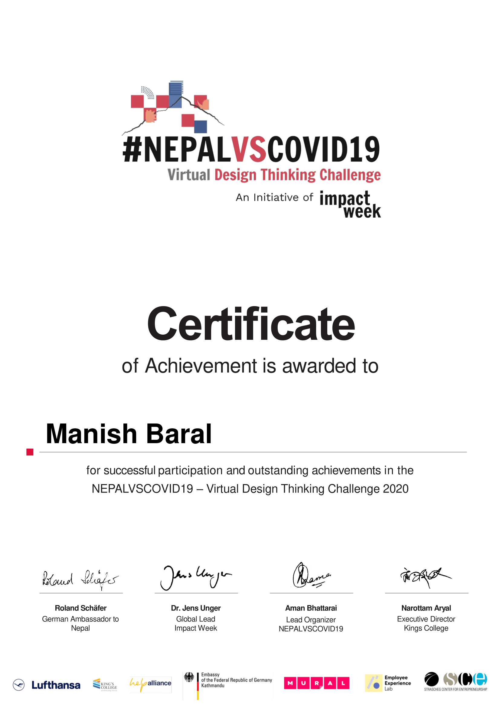

# Virtual-Impact-Week-Challenge-by-Lufthansa
1. Created a online learning platform using user centric design thinking method and did product testing.
2. Now, Implementation of the project going on.
Our Testing platform (3000+ active users) : https://ejaloacademy.com/
Marketing Platform: https://www.facebook.com/ejaloacademy/

